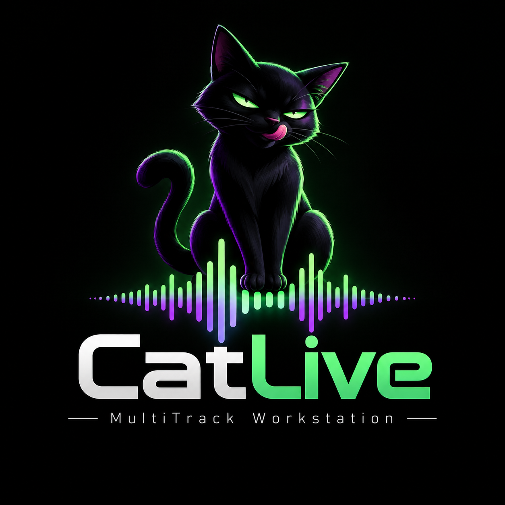

# CatLive 1.0.0

Fundação nativa de um software de multitracks para palco. O foco atual é o
**desktop**. A etapa de tablet foi adiada por orientação do produto: terminar
primeiro o desktop; depois implementar Standalone e Live Control **somente em
tablets**, sem interface de celular.



## O que funciona nesta entrega

- Aplicativo macOS 13+ em SwiftUI, com núcleo C++17 e bridge Objective-C++.
- Grid horizontal com pistas à esquerda, régua de compassos, partes, blocos
  coloridos e overview demonstrativo de waveform. O desenho está separado das
  agulhas para não reconstruir todas as formas de onda a cada frame.
- Transporte centralizado no topo: Play/Pause, Stop All, Previous, Next e Loop.
- **Sub Play:** duas posições independentes, principal verde e secundária
  amarela. Ambas avançam simultaneamente e podem ser arrastadas pelo triângulo
  na régua. O arraste destaca o brilho da agulha.
- Botão circular + compacto abaixo da última pista. Cria uma pista real no
  projeto, com UUID, nome e role; acompanha a última linha conforme a lista cresce.
- Selecionar música parado abre a música; selecionar durante reprodução
  engatilha a música na fila. Ao mudar de música, o Sub Play é reiniciado para
  não manter uma reprodução invisível de outro grid.
- Mixer com volume, pan, mute, solo e modelo inicial de roteamento.
- Inglês por padrão; troca English/Português em Settings/Configurações. Nomes
  de músicas, pistas, partes e projetos são conteúdo do usuário e não são traduzidos.
- Login, cadastro e recuperação de senha mock; sessão no Keychain; restauração,
  refresh de tokens, autorização offline e logout que libera a vaga no servidor mock.
- Licenças de 1, 2 ou 3 dispositivos, substituição atômica do menos recentemente
  visto e revogação que espera o fim da reprodução. Revogação conhecida invalida
  o cache offline, sem interromper as agulhas em andamento.
- Projeto `.jl` binário, criptografado com AES-256-GCM, com salvamento explícito pelo botão Save após alterações de
  pistas/mixer, com carregamento manual e restauração do último projeto.

**Não existe reprodução de áudio nesta fundação.** Os blocos e waveforms são
uma demonstração gerada e identificada como `DEMO · NO AUDIO`. Não há backend
remoto, sincronização de rede, ZIP, plugins, gravação nem edição completa de
clipes. Os controles alteram estado real do núcleo; não simulam som inexistente.

## Abrir e executar

Abra `CatLive.xcodeproj` no Xcode e selecione o scheme **CatLive macOS**,
destino My Mac, e Run. A versão permanece 1.0.0. A equipe de desenvolvimento
atualmente configurada é 573QZX9H7Y; outro desenvolvedor deve escolher sua própria
equipe em Signing & Capabilities.

Também é possível abrir `run macos.command`. Ele compila, instala em
`~/Applications/CatLive.app` e abre o app. Não envia nada ao GitHub.

Existe um target **CatLive iPadOS**, configurado exclusivamente para iPad,
landscape, iPadOS 16+. Está reservado para a próxima etapa: não foi instalado
nem homologado em tablet nesta entrega, conforme a nova prioridade do produto.
Quando essa etapa começar, selecione o scheme iPadOS e o iPad físico no Xcode;
a arquitetura compartilhada não inclui suporte a telefone.

No Xcode, abra LoginView, MainView, SidebarView, SongListView, TransportView ou
MixerView e ative Editor → Canvas. Os PreviewProviders usam um projeto de
memória, sem escrever sessão no Keychain ou projeto em disco.

## Login e testes de licença

Credenciais públicas exclusivamente para o mock:

- E-mail: `demo@catlive.app`
- Senha: `catlive123`

Escolha 1, 2 ou 3 dispositivos e o cenário Normal, Blocked, Expired ou Revoked
antes de entrar. Senha incorreta exercita o login inválido. Cadastro cria outra
conta apenas no mock local; a recuperação de senha mostra confirmação simulada,
sem enviar e-mail.

Em Settings, é possível simular falta de internet, validar novamente, revogar
este dispositivo ou fazer logins de dispositivos virtuais até ocupar as vagas.
Para verificar a segurança durante o show, dê Play e Sub Play, revogue o
dispositivo e volte ao grid. A execução atual continua. Stop All ou a conclusão
das duas agulhas aplica o bloqueio; novas execuções ficam impedidas durante a
revogação pendente. Logout é desabilitado durante reprodução e só informa
sucesso depois de invalidar a sessão/liberar a vaga no backend.

O mock é um actor que representa o servidor e serializa a troca de dispositivos
sem suspensão dentro da transação. Vários clientes de teste compartilham esse
actor. Ele **não** comunica um Mac real com outro tablet; isso depende do backend
remoto futuro. Tokens do cliente ficam no Keychain. O arquivo local do servidor
mock mantém somente hashes dos tokens e das credenciais de demonstração.

## Arquitetura e arquivos

```text
Apple/Shared/*View.swift       → UI e previews
Application/AppState          → ShowController e CommandExecutor
Apple/Bridge                  → LocalCommandExecutor e JarasCoreBridge.mm
Core/Transport/Engine.*        → reprodução, fila, loop, Sub Play, comandos
Core/Project                  → Project, Setlist e validação
Core/Tracks, Songs, Parts      → modelos portáveis
Core/Mixer, Queue, Loop        → estados e roteamento
Core/Import                   → TrackTaxonomy, TrackClassifier, ProjectImporter
Core/Audio                    → contrato AudioEngine independente de plataforma
Core/Serialization            → contrato ProjectCodec
Core/MIDI, Sync                → contratos iniciais, sem transporte de rede/MIDI
Application/Auth              → AuthService e SecureStore/Keychain
Application/Licensing         → EntitlementService
Application/Devices           → installationId e autorização
Application/Backend           → protocolo, servidor mock, cliente remoto reservado
Application/Project           → modelos Codable e persistência atômica em JSON
```

O Core não importa SwiftUI, AppKit, UIKit, Keychain ou serviços de conta. O
transport demonstrativo recebe tempo monotônico da aplicação. O callback real
futuro deverá usar clock de samples e filas de comandos sem locks/alocações;
a interface AudioEngine já separa preparação de recursos e renderização.

As consultas de licença ocorrem fora do motor de áudio. A UI chama um
CommandExecutor, portanto o futuro executor remoto poderá substituir o local
sem reescrever os botões. RemoteCommandExecutor/RemoteBackendClient recusam
operações ainda não configuradas; não fingem conexão bem-sucedida.

ProjectStore realiza I/O isolado em actor. O Core valida tempos, referências,
volumes e caminhos relativos. A bridge usa a serialização Foundation para o
mesmo manifest Codable; o round trip Swift JSON → C++ → JSON é testado com
clipes, waveforms, pistas, partes e UUIDs.

## Persistência

- Keychain service `com.hookdeveloper.jaraslive`: sessão/cache de entitlement e
  installationId por instalação. Não usa identificação invasiva do hardware.
- Projetos `.jl`: salvos no local escolhido pelo usuário; áudios em `Steams/` ao lado do documento. A abertura começa pelo seletor de projetos, sem carregar demonstrações automaticamente.
- Application Support/JarasLive/mock-server.json: estado do servidor de demonstração.
- UserDefaults: idioma e zoom. O padrão de idioma é `en`.

## Exportar para app — próxima etapa

Este é o nome oficial da futura ação. Ela deverá produzir um ZIP portátil com
`project.json`, `audio/`, `artwork/` e `metadata/`, copiando arquivos necessários
e preservando UUIDs, pistas, clipes, partes, mixer, roteamento e referências
relativas. `AudioFile.sha256` prepara integridade e deduplicação. O importador
futuro deverá validar hashes, limites de tamanho, versão e caminhos antes de
extrair. Não existem paths absolutos no manifest.

O tablet terá Standalone (Core/áudio locais) e Live Control (comandos remotos).
Cada instalação autorizada consome uma vaga em ambos os modos. Rede, ZIP e
motores específicos de tablet entram após o desktop.

## Testes

```sh
./scripts/test.sh
./scripts/test-bridge.sh
```

O primeiro executa os testes C++ e XCTest de Application; o segundo compila a
bridge Objective-C++ real, gera um manifest Swift e verifica round trip,
comandos, posições independentes e criação de pista. Os testes cobrem fila,
loop, next/previous, transporte, taxonomia com acentos, paths portáveis,
limites de licença, concorrência, substituição, logout, sessão persistente,
refresh, offline e revogação segura.

O núcleo também pode ser compilado com CMake: `cmake -S . -B build/core` e
`cmake --build build/core`, seguido de `ctest --test-dir build/core`.

## Estender

- Comandos: adicionar ao CommandKind/Engine no Core, ao ShowCommand em
  Application e ao mapeamento da bridge. A View somente envia o comando.
- TrackRole: o identificador é extensível e independente de `Track.name`.
  Adicione o role, sua apresentação em Theme/idiomas e aliases na taxonomia.
- Aliases: `TrackTaxonomy::addAlias`; a classificação normaliza maiúsculas,
  acentos, extensão do arquivo e sufixos como L/R.
- Backend real: implementar BackendClient no RemoteBackendClient e injetá-lo
  nos serviços. O servidor deve garantir atomicamente a autorização/limites;
  não basta confiar no cache local. Segredos privados nunca entram no cliente.
- Novo arquivo Apple: execute `python3 scripts/generate-project.py` para
  atualizar o projeto Xcode determinístico.

Próxima prioridade: evoluir o desktop com importação de áudio, waveforms reais,
engine sample-accurate com duas posições de reprodução e roteamento de saídas;
depois edição/organização do show e a ação Exportar para app.

## Verificação desta entrega

Build Release macOS universal (arm64 + x86_64) aprovado, assinatura de
desenvolvimento verificada. Testes C++, bridge real e seis XCTest passaram.
Na janela real foram verificados login mock, restauração de sessão, arraste
independente das duas agulhas, Play/Sub Play simultâneos, Stop All, criação de
pista e alternância English/Português. O app foi instalado em
`~/Applications/CatLive.app`. A logo acima é a identidade visual atual do aplicativo.

Não foi feita publicação/notarização do CatLive nem homologação em iPad
nesta etapa. O código está dentro do repositório da Hook Center, sem embutir
certificados ou copiar secrets para o projeto.

### Importação de stems

Create Project oferece Add Stems ou Empty e exige salvar o `.jl` antes de abrir o editor. Add Project adiciona pastas ao documento atual ou a um `.jl` escolhido. Open Project lista os recentes e permite procurar no Finder. Os nomes são analisados pelas regras atuais de Create Project e Hook Rename da Hook Center, embarcadas via `scripts/sync-import-rules.py` e executadas localmente por JavaScriptCore, sem depender de Node instalado.

A primeira região começa em 30 segundos, com 30 segundos entre regiões. As sugestões de limpeza são opcionais e alteram somente nomes importados e cópias: os originais são preservados. Arquivos WAV, AIFF e MP3 são analisados fora da thread da interface em buffers limitados; cada item guarda seu próprio áudio, waveform e ganho. Pistas equivalentes são reutilizadas e classificações duplicadas na mesma música ganham pistas separadas.

O documento `.jl` usa AES-256-GCM com nonce aleatório a cada gravação e cabeçalho versionado autenticado. A chave pertence ao aplicativo para permitir abrir o projeto em outra instalação; protege contra leitura e edição casual, não contra engenharia reversa do aplicativo. Os arquivos de áudio da pasta Steams continuam no formato original. Documentos JSON de desenvolvimento podem ser abertos e passam a ser criptografados ao salvar.
